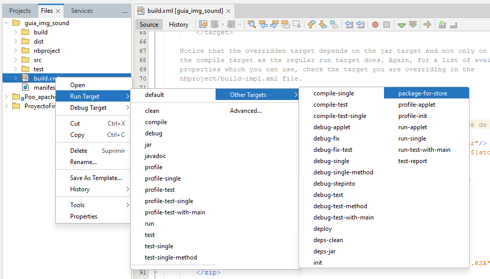
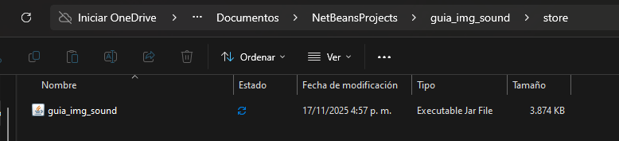
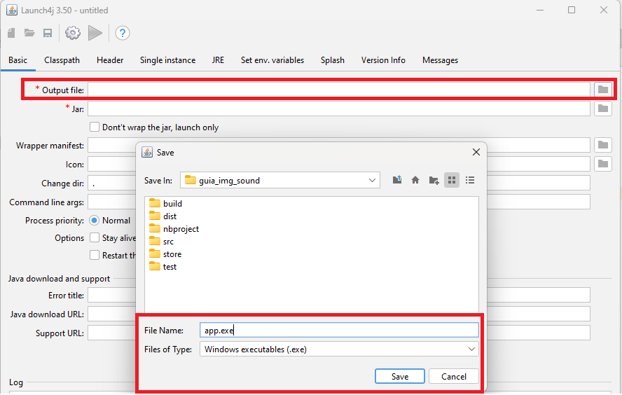
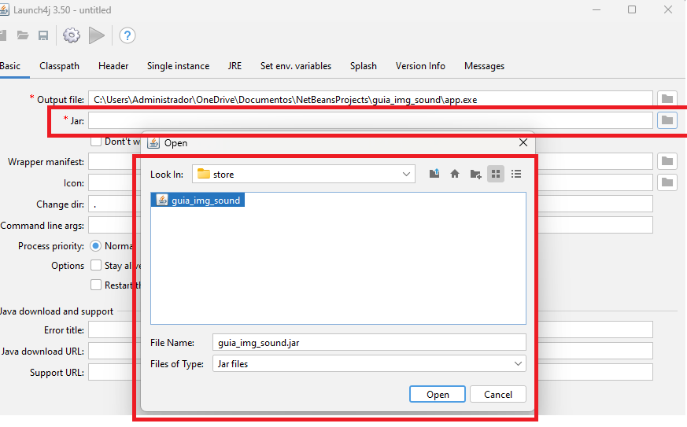
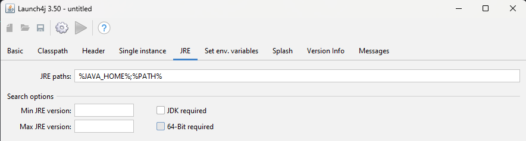
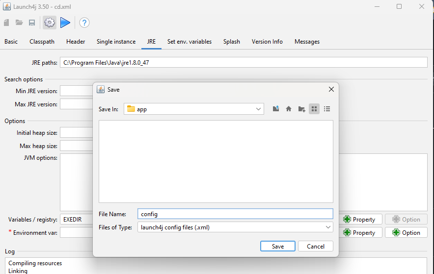

# guia_crear_exe_apache_netbeans

Requisitos previos

Java JDK 8+
Apache NetBeans 12+
Launch4j (versión independiente o instalador)
(Opcional) JRE portátil si quieres empaquetar la app con Java incluido

# paso #1
Antes de crear el archivo de preparación del proyecto debemos configurar algo en la parte de files en el archivo build.xml con el siguiente codigo antes de la ultima etiqueta del documento

code:
https://drive.google.com/file/d/1lCib1k2gtUbJfxX4Kr3ninU_jFWKBEgX/edit

<target name="package-for-store" depends="jar">
    <property name="store.jar.name" value="NombreProyecto"/> <!-- Nombre de tu proyecto -->
    <property name="store.dir" value="store"/>
    <property name="store.jar" value="${store.dir}/${store.jar.name}.jar"/>
    <echo message="Packaging ${application.title} into a single JAR at ${store.jar}"/>
    <delete dir="${store.dir}"/>
    <mkdir dir="${store.dir}"/>
    <jar destfile="${store.dir}/temp_final.jar" filesetmanifest="skip">
        <zipgroupfileset dir="dist" includes="*.jar"/>
        <zipgroupfileset dir="dist/lib" includes="*.jar"/>
        <manifest>
            <attribute name="Main-Class" value="${main.class}"/>
        </manifest>
    </jar>
    <zip destfile="${store.jar}">
        <zipfileset src="${store.dir}/temp_final.jar"
        excludes="META-INF/*.SF, META-INF/*.DSA, META-INF/*.RSA"/>
    </zip>
    <delete file="${store.dir}/temp_final.jar"/>
</target>

asi: 

posteriormente, Nos dirijimos a el proyecto en la parte de la barra lateral y damos click derecho sobre el archivo build.xml, luego elegimos la opciones:

run_target -> other targets -> run packague_for_store

# paso #2

verificamos que este el ejecutable .JAR en los archivos del proyecto desde el equipo

dentro de store estara el archivo JAR

# paso #3

Desacargar e instalar Lauch4j (buscarlo en la web)

# paso #4 

Llenar los datos para crear el archivo .exe, empezando por la ruta donde queremos guardar el archivo asignandole el correspondiente nombre con la terminacion .exe como se ve en la siguiente imagen:

Luego elegimos la ubicacion de nuestro archivo .JAR creado en el paso #2 

# paso #5 

Elegir la ruta del JDK de java o usar la direccion de variable de entorno 

si usa la variable de entorno se pondra por defecto asi:

por el contrario buscar la siguiente ruta del archivo:

Disco local c -> archivos de programa ->java -> jkd (copiar ruta)

# paso 6

para compilar y crear el archivo .exe vamos a seleciona ek icono del engranaje de la parte superior, y elegimos la ubicacion con el nombre para el archivo de configuracion "Ejemplo: config.xml"

# Video guia - referencia

https://www.youtube.com/watch?v=BN_SFmEzCpI 
